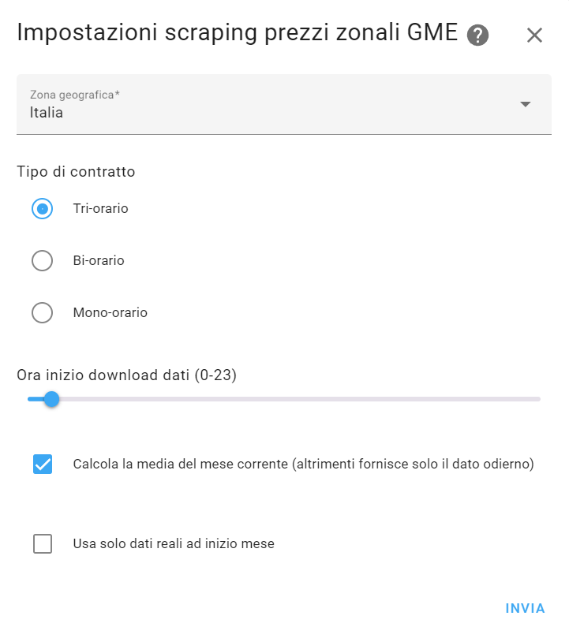

# Prezzi PUN e zonali del mese

[](https://github.com/hacs/integration)

[](https://github.com/Gariam-1/Prezzi-zonali-GME/actions/workflows/validate.yaml)
[](https://github.com/Gariam-1/Prezzi-zonali-GME/releases)

La mia versione dell'integrazione di [virtualdj](https://github.com/virtualdj). Ho aggiunto il prezzi zonali e i prezzi orari.

Descrizione originale:

Integrazione per **Home Assistant** (derivata dall'integrazione [pun_sensor](https://github.com/virtualdj/pun_sensor) di virtualdj) che mostra i prezzi stimati del mese corrente per fasce orarie (F1, F2, F3, F23 e mono-orario) nonché la fascia oraria attuale e il prezzo dell'ora corrente.

I valori vengono scaricati dal sito [MercatoElettrico.org](https://gme.mercatoelettrico.org/it-it/Home/Esiti/Elettricita/MGP/Esiti/PUN), i prezzi delle fasce vengono calcolati dai prezzi orari con una media ponderata sul fabbisogno stimato nella zona selezionata, come segue: somma_ore(prezzi * fabbisogno) / somma_ore(fabbisogno).

## Installazione in Home Assistant

Installare usando [HACS](https://hacs.xyz/) tramite il menu con i tre puntini nell'angolo in alto a destra e scegliendo _Add custom repository_ e aggiungendo l'URL https://github.com/Gariam-1/Prezzi-zonali-GME alla lista.

Installare **manualmente** clonando o copiando questa repository e poi copiando la cartella `custom_components/pzo_sensor` nella cartella `/custom_components/pzo_sensor` di Home Assistant, che andrà successivamente riavviato.

### Configurazione

Dopo l'aggiunta dell'integrazione oppure cliccando il pulsante _Configurazione_ nelle impostazioni di Home Assistant, verrà visualizzata questa finestra:



Qui, per prima cosa, va selezionata la zona geografica per cui desideri avere i prezzi. Se non si è sicuri di quale zona scegliere si può chiedere al proprio fornitore o consulare il file pubbicato [QUI](https://www.terna.it/it/sistema-elettrico/pubblicazioni/news-operatori/dettaglio/Suddivisione-in-zone-di-mercato-della-Rete-di-Trasmissione-Nazionale-valida-a-partire-dal-1%C2%B0-gennaio-2021).

Successivamente è possibile selezionare un'ora del giorno in cui scaricare i prezzi aggiornati dell'energia (default: 1); il minuto di esecuzione, invece, è determinato automaticamente per evitare di gravare eccessivamente sulle API del sito (e mantenuto fisso, finché l'ora non viene modificata). Nel caso per qualche ragione il sito non fosse raggiungibile, verranno effettuati altri tentativi dopo 10, 30, 60, 120, 180 e 240 minuti.

Se la casella di controllo _Usa solo dati reali ad inizio mese_ è **attivata**, all'inizio del mese quando non ci sono i prezzi per tutte le fasce orarie questi vengono disabilitati (non viene mostrato quindi un prezzo in €/kWh finché i dati non sono in numero sufficiente); nel caso invece la casella fosse **disattivata** (default) nel conteggio vengono inclusi gli ultimi giorni del mese precedente in modo da avere sempre un valore in €/kWh.

### Aggiornamento manuale

È possibile forzare un **aggiornamento manuale** richiamando il servizio _Home Assistant Core Integration: Aggiorna entità_ (`homeassistant.update_entity`) e passando come destinazione una qualsiasi entità tra quelle fornite da questa integrazione: questo causerà chiaramente un nuovo download immediato dei dati.

### Aspetto dei dati


L'integrazione fornisce il nome della fascia corrente relativa all'orario di Home Assistant (tra F1 / F2 / F3), i prezzi delle tre fasce F1 / F2 / F3 / F23, la fascia mono-oraria, il prezzo della fascia corrente e il prezzo dell'ora corrente.

### Prezzo al dettaglio

Questo componente fornisce informazioni sul prezzo all'**ingrosso** dell'energia elettrica: per calcolare il prezzo al dettaglio, è necessario creare un sensore fittizio (o _template sensor_), basato sui dati specifici del proprio contratto con il fornitore finale aggiungendo tasse e costi fissi.

Di seguito un esempio di un sensore configurato manualmente modificando il file `configuration.yaml` di Home Assistant:

```yml
# Template sensors section
template:
  - sensor:
      - unique_id: prezzo_attuale_energia_al_dettaglio
        name: "Prezzo attuale energia al dettaglio"
        icon: mdi:currency-eur
        unit_of_measurement: "€/kWh"
        state: >
          {{ (1.1 * (states('sensor.prezzo_zonale_fascia_corrente')|float(0) + 0.0087 + 0.04 + 0.0227))|round(3) }}
```

### Calcolo delle fasce

Il calcolo delle fasce che ho implementato è un test basato su informazioni che ho trovato qua e là, non sono perciò sicuro che sia giusto (parte della ragione per cui ho optato su una pre-release).
Chiedo perciò un vostro input per verificare che sia effettivamente legittimo, oppure per sostituirlo con quello corretto.

### In caso di problemi

È possibile abilitare la registrazione dei log tramite l'interfaccia grafica in **Impostazioni > Dispositivi e servizi > Prezzi PUN del mese** e cliccando sul pulsante **Abilita la registrazione di debug**.


Il tasto verrà modificato come nell'immagine qui sotto:


Dopo che si verifica il problema, premerlo nuovamente: in questo modo verrà scaricato un file di log con le informazioni da allegare alle [Issue](https://github.com/Gariam-1/Prezzi-zonali-GME/issues).

### Note di sviluppo

Potete trovare un diario dell'esperienza di programmazione dell'[itegrazione originale](https://github.com/virtualdj/pun_sensor) da virtualdj in [questa pagina](DEVELOPMENT.md). Troverete i link alle pagine dei progetti che lo hanno aiutato a svilupparla così com'è ora.